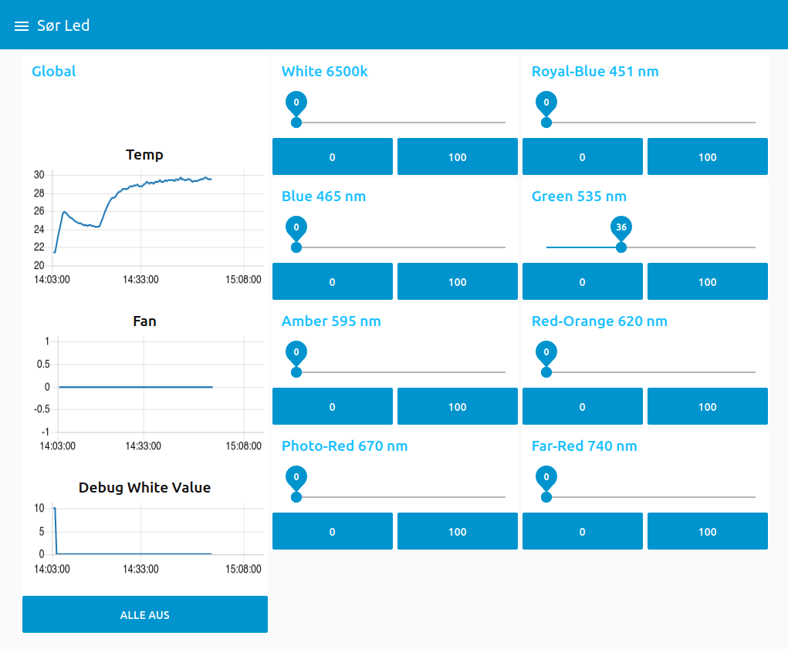

# Flexible Grow LED

This project is the result of Sören Krusche's student research project.
The aim was to create a flexible LED light for growing plants with adjustable wavelengths.
It encompases the CAD files for the electronics and 3D printed components as well as the source code for the ESP8266 and the Node-RED flow.

## Node-RED Dashboard

The flow can be found in the Node-RED_Flow folder.

## PCB Design

Insert PCB image

The design files can be found in the CAD/EAGLE folder.

## 3D Printed Model

Insert 3D printed model

The design files can be found in the CAD/Fusion360 folder.

## PlatformIO Project

The source code for the ESP8266 can be found in the PlatformIO folder.